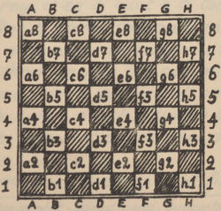

# Der deutsche Occidentalist

2\. Jahrgang №  10 (22) —  15. November 1934

Mitteilungsblatt des Deutschen Occidental-Sprachbundes (G.O.F.)

---

## Li terminologie del shac-lude

Sovente li shac-lude es nominat li ›reyal lude‹, e que it porta ti nómine con plen jure, pruva a nos su historie, comensant circa six cent annus ante Christo, in India. Alquicos cert pri su origine on ne save, ma li régules del lude changeat poc a poc in li curs del sécules, till que illi atin’et in li medievie li statu essent valid ancor hodie. 1561 apparit li unésim theorie del ›occidental‹ shac-lude, li autor de quel esset li hispan clerico e shac-maestro Ruy Lopez, qui pro su eminent lud-arte esset vocat al corte del hispan rey. Durant li secuent sécules presc omni cultur-nationes del occidente contribuet famosi nómines al liste del grand-maestros sur li sixantquar casas. Noi audi li nómines Damiano, Greco, Philidor, Andersen, Morphy e mult altris quam irrefutabil prova por li ínexhaustibil bellesse e profundesse de ti unic lude. On vell posser dubitar classificar li shac quam *lude*, si on conosse li extension de su theorie e li desfacilitá luder it correctmen.

In India li 64 casas del shac-tábul esset nominat ‚granieres‘, e li arabos usat li expression ›dom‹ por casa. De to veni nor parol ›casa‹, quel significa in li italian e hispan lingue ›dom‹.* Noi va usar li secuent notation por indicar li síngul casa:

\* Ramstedt usa por casa ›quadre‹.

Li nómines del shac-figures o pieces es in Occidental: li rey (abreviat signe de notation: R); li dama o reyina (D); li turre o rocco (T); li cursor o alfil (C); e li saltator o cavaliero (S). Li pion recive su signe de notation P solmen si it es necessi por evitar miscomprenses.

Li shac-lude esset in li medievie forsan ancor plu populari quam hodie, ma con li differentie, que on ludet pro moné. Mem li cléricos sur li púlpit usat li expressiones del shac-lude por allegorisar lor predicas. Li clerico Cessolis inventet 1275 p. Chr. special e caracterisant nómines por li piones:

- h2 (h7) esset li paisan,
- g2 (g7) " " forjero,
- f2 (f7) " " notario,
- e2 (e7) " " mercator,
- d2 (d7) " " medico,
- c2 (c7) " " hósped,
- b2 (b7) " " guardian e
- a2 (a7) " " rixard.

Li piones sur d2, e2, d7, e7 es li medial piones dominant li centre (d4, e4, d5, e5). Ultra to noi conosse duplic e triplic piones, it es piones stant detra unaltru, por exemple Pf2, Pf3. Ligat piones es Pd2, Pe3, proque d2 defende e3 e talmen es ligat con it. Isolat piones ha perdit lor camarades durant li curs del combatte sur li shac-tábul e sovente es in li sam dangere quam li retardat piones, queles ne posset secuer lor avansant camarades. Un liber pion ne vide avan se piones del adversario e marcha con succurs de figures de su propri colore al unésim linea del adversario, ú il vole e deve devenir officero (dama, turre, cursor o saltator).
