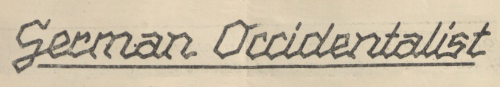

## Benevenit!

Ci vu trova li numerós 1 til 36 (sin 4, 10, 11, 12) del revúe *German Occidentalist*, editet in li annus 1930 del German Occidental-Federation (Deutscher Occidental-Sprachbund).

Li federation inviat it al membres por informar pri su activitá, ma it contenet anc altri articules pri divers temas. Li activitá del federation, quel havet 24 membres, esset prohibit del guvernament national-socialistic in junio 1936.

Li textu de omni numerós es traserchabil per cliccar li lupe-simbol in supra a levul. Li simboles in li menú a levul indica li lingue(s) in quel(es) chascun numeró es scrit.

Vu posse vider li originales in forme de images digital sur li websitu del Biblioteca National de Austria ([1933](https://digital.onb.ac.at/RepViewer/viewer.faces?doc=DOD_60772), [1934–35](https://digital.onb.ac.at/RepViewer/viewer.faces?doc=DOD_60773)).

Por scopes de scientie, resercha e civic information pri li mundlinguistic movement, ti-ci págines provide textus del epoca del national-socialisme. Li creatores del págines distantia se clarmen de omni contenete quel promoe, justifica, glorifica o bagatellisa national-socialistic opiniones, scopes o organisationes.

Zu Zwecken von Wissenschaft, Forschung und staatsbürgerlicher Aufklärung über die Weltsprachebewegung stellen diese Seiten Texte aus der Zeit des Nationalsozialismus zur Verfügung. Die Ersteller der Seiten distanzieren sich ausdrücklich von allen Inhalten, die nationalsozialistische Anschauungen, Ziele oder Organisationen bewerben, rechtfertigen, verherrlichen oder verharmlosen.

